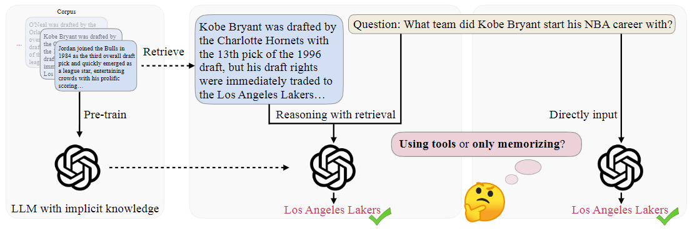

<div align= "center">
    <h1> 🛠️ToolQA</h1>
</div>

🛠️ The official repository for code and data of **ToolQA** dataset. ToolQA is a open-source dataset specifically designed for evaluations on tool-augmented large language models (LLMs). This repo provides the dataset, the corresponding data generation code, and the implementations of baselines on our dataset.

## Features

- Our questions are selected and guaranteed that **LLMs have little chance to memorize and answer correctly within their internal knowledge**;
- The majority of the questions in ToolQA **require compositional use of multiple tools**. According to the length of toolchains, we offer two different difficult levels of dataset: **Easy** and **Hard**.
- We apply **a thorough diagnosis and analysis of in-context tool-augmented LLMs** in our paper.
- ToolQA is created via **collaboration between humans and AI**, adaptable to new data and questions with automation.

<p align="center">
  
</p>

## Dataset Statistics
ToolQA consists of data from 8 distinct domains, each instance being a tuple — (question, answer, reference corpora, and tools). The reference corpora are external knowledge sources that can be queried, which can be a text corpus, a tabular database, or a graph.

| Context      |  Topic | Knowledge Format        |  Knowledge Size  | # Easy Templates | # Easy Questions | # Hard Templates | # Hard Questions |
|--------------|:------:|:--------------------:|:-------:|:----------------:|:----------------:|:----------------:|:----------------:|
| Temporal     | Flight |   Tabular Database   | 4078318 |        10        |        100       |        10        |        100       |
| Temporal     | Coffee |   Tabular Database   |   5746  |         8        |        100       |        13        |        130       |
| Spatial      |  Yelp  |   Tabular Database   |  150346 |        11        |        100       |        10        |        100       |
| Spatial      | Airbnb |   Tabular Database   |  102599 |        10        |        100       |        10        |        100       |
| Mathematical |  GSM8K | Professional Ability |    -    |         -        |        100       |         -        |         -        |
| Social       |  DBLP  |         Graph        |  553320 |        10        |        100       |        10        |        100       |
| Scientific   | SciREX |   Pure-Text Corpus   |   438   |         1        |        100       |         4        |        100       |
| Personal     | Agenda |   Pure-Text Corpus   |  10000  |         5        |        100       |         5        |        100       |
| **SUM**      |  **-** |         **-**        |  **-**  |      **55**      |      **800**     |      **62**      |      **730**     |

## Data Download
We offer the download link for all the data involved in ToolQA. We offer two categories of data for download and use. The first category is **external corpus**. This sort of data have already been pre-processed by us and they are used for external tools to interact, (e.g., retrieve, database operations, etc.). The second category of data is the **raw data**, which cannot be used as external knowledge of ToolQA to interact. We offer this part of data just for users if they want to generate more questions and answers for model tuning or thorough evaluation.

### External Corpus Download
The external corpus can be downloaded through [this link](https://drive.google.com/file/d/1zRbHzPW2x4dDcfmphBWlan8cxUCRNmqk/view?usp=drive_link). After downloading and unzipping, users need to place it under the directory  ``/<YOUR_OWN_PATH>/ToolQA/data/external_corpus/``.

### Raw Data Download
All the data sources and download guidance are listed below:
- **Flight**: You can download the raw flight data from the [Download Link](https://www.kaggle.com/datasets/robikscube/flight-delay-dataset-20182022?select=Combined_Flights_2022.csv). Please place the ``Combined_Flights_2022.csv`` file under the directory ``/<YOUR_OWN_PATH>/ToolQA/data/raw_data/flights/``.
- **Coffee**: You can download the raw coffee data from the [Download Link](https://www.kaggle.com/datasets/psycon/daily-coffee-price). Please place the ``coffee.csv`` file under the directory ``/<YOUR_OWN_PATH>/ToolQA/data/raw_data/coffee/``.
- **Yelp**: You can download the raw Yelp data from the [Download Link](https://www.kaggle.com/datasets/yelp-dataset/yelp-dataset?select=yelp_academic_dataset_business.json). Please place the ``yelp_academic_dataset_business.json`` file under the directory ``/<YOUR_OWN_PATH>/ToolQA/data/raw_data/yelp/``.
- **Airbnb**: You can download the raw Airbnb data from the [Download Link](https://www.kaggle.com/datasets/arianazmoudeh/airbnbopendata). Please place the ``Airbnb_Open_data.csv`` file under the directory ``/<YOUR_OWN_PATH>/ToolQA/data/raw_data/airbnb/``.
- **DBLP**: You can download the raw DBLP data from the [Download Link](https://www.aminer.org/citation). Please place the ``DBLP-Citation-network V14.zip`` file under the directory ``/<YOUR_OWN_PATH>/ToolQA/data/raw_data/dblp/``.
- **GSM8K**: You can download the raw GSM8K data from the [Download Link](https://github.com/openai/grade-school-math). Please run ChatGPT vanilla on the raw questions and place the result file ``gsm.chat.jsonl`` under the directory ``/<YOUR_OWN_PATH>/ToolQA/data/raw_data/gsm8k/``.
- **SciREX**: You can download the raw SciREX data from the [Download Link](https://github.com/allenai/SciREX). Please place the dataset files ``train.jsonl``, ``val.jsonl``, and ``test.jsonl`` under the directory ``/<YOUR_OWN_PATH>/ToolQA/data/raw_data/scirex/``.
- **Agenda**: You can download the raw data from our prepared [Download Link](https://drive.google.com/file/d/1A-DP_EFGVglaXf6-RUzN2Oq4rB58jExG/view?usp=drive_link). Please place the file ``agenda_events.jsonl`` under the directory ``/<YOUR_OWN_PATH>/ToolQA/data/raw_data/agenda/``.

### Generate New Questions
You can also use the ToolQA to generate new questions under our templates for tuning and new sets of evalations. We offer the data generation code in `/dataset_generation/` directory. The only thing to do is to modify the paths in the notebooks.

## Tool Implementation

We offer a list of implemented tools in each of the baselines in the benchmark, like ``./benchmark/ReAct/code/tools``. Please note that the questions are intentionally designed to be open-ended. This reflects our belief that these questions pose sufficient challenges, and we don't wish to limit the tools suggested in our paper. We welcome experiments with more advanced tools (like a superior retriever) to enhance performance or devising a more effective planning module for better compositional usage of our defined tools. Therefore, we are excited to see diverse implementations in response to all our questions.

### Retriever
We implement the retriever with [Langchain](https://python.langchain.com/) package and the [Chroma vector database](https://docs.trychroma.com/). We have uploaded the pre-processed chroma vectorbase in the [Download Link](https://drive.google.com/file/d/1A--blpdTbH8C_UeLvyi2mxnqXEKaK7pp/view?usp=sharing). Please download the file under the directory ``/<YOUR_OWN_PATH>/ToolQA/data/chroma_db/``.

### SQL Interpreter
To interprete SQL commands, the user may need to load the database into the mysql database first. You can run the following commands for database creation (the entire process may take hours):
```python
python ./benchmark/ReAct/code/tools/table/mysql_db_create.py
```

### Math Calculator
To use the calculator in the implementation. You first need to sign up an account through the official [Wolframalpha developer portal](https://account.wolfram.com/login/oauth2/sign-in).

## Current Progress
The data and code are in the final stage of cleaning and will be public gradually in a very short period. We offer the detailed progress of the final examination in the TODO list part.

### Open-source Progress
- [x] ~~Release all the easy and hard questions;~~
- [x] ~~Tool Implementations;~~
- [x] ~~All the benchmark code release;~~
- [ ] Update the benchmark code.

## Questions?
If you have any questions, feel free to reach out to `yczhuang at gatech.edu`. Please try to specify the problem with details so we can help you better and quicker!

## Citation
If you find this repository valuable for your research, we kindly request that you acknowledge our paper by citing the following paper. We appreciate your consideration.
```
@misc{zhuang2023toolqa,
      title={ToolQA: A Dataset for LLM Question Answering with External Tools}, 
      author={Yuchen Zhuang and Yue Yu and Kuan Wang and Haotian Sun and Chao Zhang},
      year={2023},
      eprint={2306.13304},
      archivePrefix={arXiv},
      primaryClass={cs.CL}
}
```
